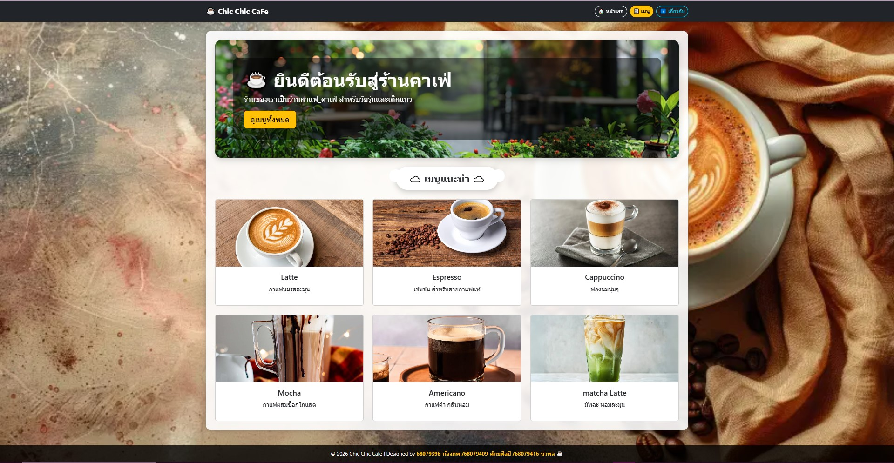
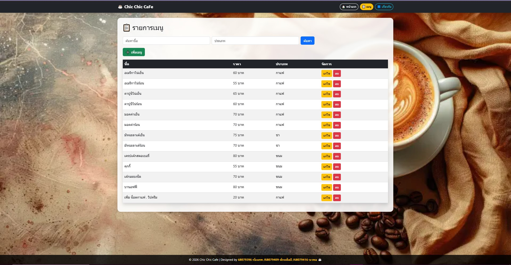
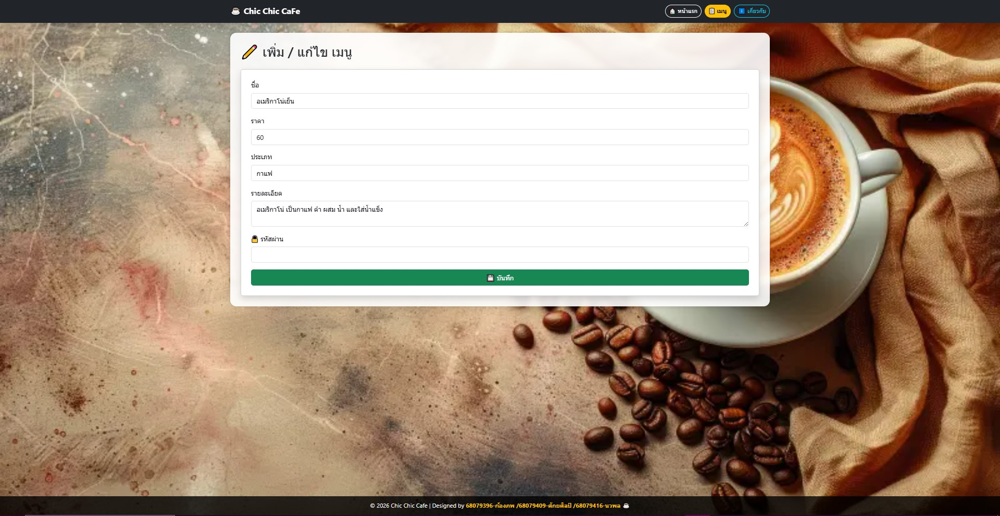
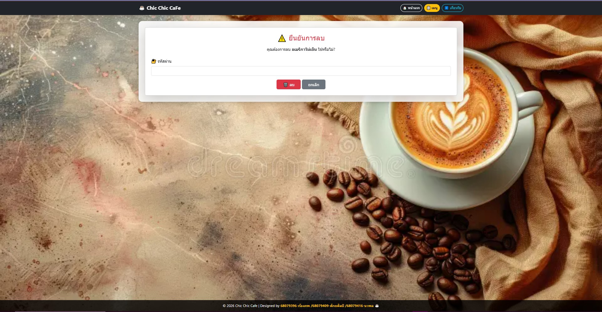
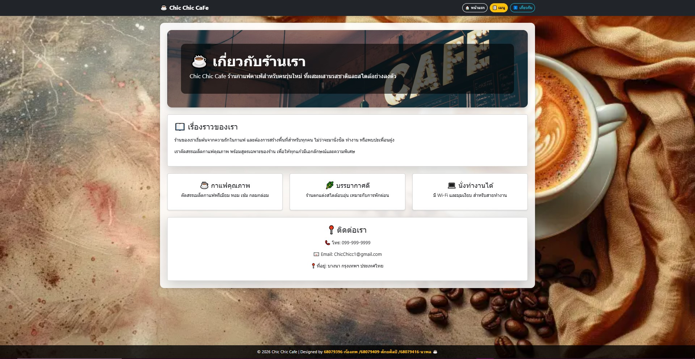

# ☕ Chic Chic Cafe (Django Web Project)

## 📌 รายละเอียดโปรเจค

เว็บไซต์ระบบจัดการเมนูร้านกาแฟ พัฒนาโดยใช้ Django Framework
สามารถเพิ่ม แก้ไข ลบ และค้นหาเมนูได้

---

## 🚀 ฟีเจอร์หลัก

* แสดงรายการเมนูจากฐานข้อมูล
* ค้นหาข้อมูล (ชื่อ / ประเภท)
* เพิ่ม / แก้ไข / ลบ เมนู
* มีการยืนยันรหัสผ่านก่อนแก้ไขและลบข้อมูล
* มีหน้าตาเว็บไซต์ (UI) ด้วย Bootstrap

---

## 🛠️ เทคโนโลยีที่ใช้

* Python
* Django
* Bootstrap 5

---

## ⚙️ วิธีติดตั้งและใช้งาน

### 1. Clone โปรเจค

```
git clone https://github.com/sakayasinjud/Project-Chi-Chi-CaFe.git
```

### 2. เข้าโฟลเดอร์โปรเจค

```
cd Project-Chi-Chi-CaFe
```

### 3. ติดตั้ง Django

```
pip install django
```

### 4. migrate ฐานข้อมูล

```
python manage.py migrate
```

### 5. รันเซิร์ฟเวอร์

```
python manage.py runserver
```

### 6. เปิดเว็บไซต์

```
http://127.0.0.1:8000/
```

---

## 🔐 การใช้งานระบบจัดการเมนู

* ผู้ใช้ทั่วไป: ดูเมนูและค้นหาได้
* เจ้าของร้าน: เพิ่ม / แก้ไข / ลบ เมนู (ต้องใส่รหัสผ่าน)

**รหัสผ่าน:** `1234`

---

## 📷 ตัวอย่างหน้าเว็บ

### หน้าแรก



### หน้าเมนู



### หน้าเพิ่ม / แก้ไข เมนู



### หน้ายืนยันการลบ



### หน้าเกี่ยวกับ



---

## 👨‍💻 ผู้จัดทำ

* 68079396 ก้องภพ
* 68079409 ศักยศิลป์
* 68079416 นวพล
